# 2DollarDMX

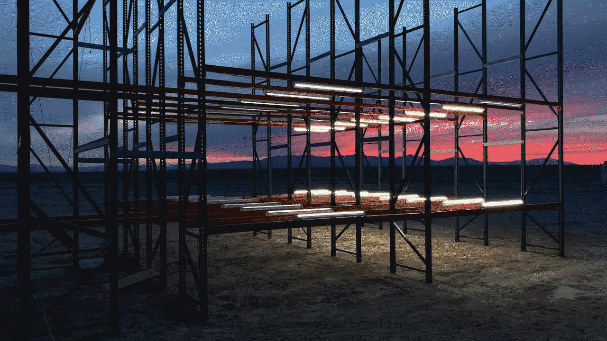

An expandable, open-source platform for controlling arrays of Solid State Relays from [Arduino](https://www.arduino.cc/) and [Raspberry Pi](https://www.raspberrypi.org/) with the [CD4094](https://www.alldatasheet.com/datasheet-pdf/pdf/26896/TI/CD4094.html). At the time, it seemed like a cheap alternative to buying a proper [DMX system](https://en.wikipedia.org/wiki/DMX512).

## System Overview

* The 2DollarDMX system allows for the control of binary, on-off AC powered devices (e.g. lights, fans, blenders, TVs, etc...).
* This is accomplished by switching 120/240VAC using solid state relays.
* Relays are chosen based on application but generally are designed to handle 25A loads and controlled by 3.3V-5V pulses.
* Control signals are generated by user-customizable software and low-cost hardware platforms such as Arduino and Raspberry Pi.
* The CD4094, an 8-bit latched shift register from the CMOS 4000 logic family IC, is used to extend the number of controllable devices.
* Either and Arduino of Raspberry Pi control the CD4094 using a mere 4 pins. It's possible for multiple CD4094 ICs to be daisy chained to expand the number of controllable channels.

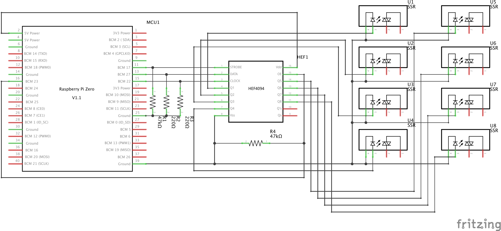<br>
A schematic example illustrating the connections between a Raspberry Pi Zero, CD4094 shift register, and an array of Solid State Relays (SSRs).

### Hardware:


#### Shift Registers

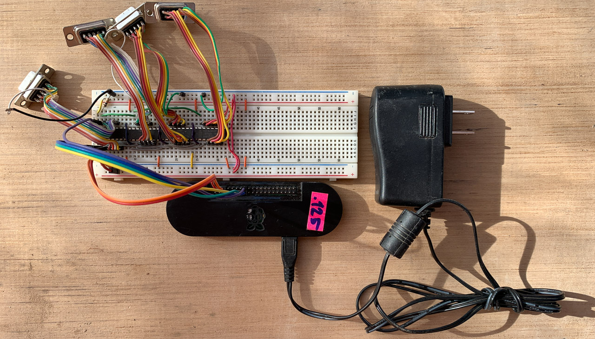

Raspberry Pi Zero W Connected to a series of 4 daisy chained CD4094 ICs on a breadboard:

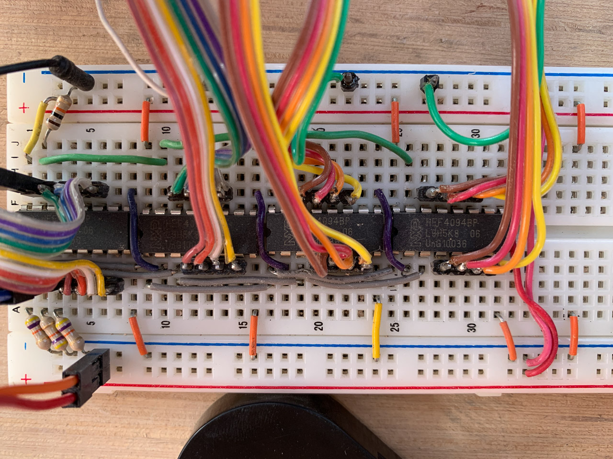

#### Solid State Relays

The Solid State Relays are housed in a gutted and repurposed 8 outlet DJ power distribution box that was sold by Guitar Center for $35.

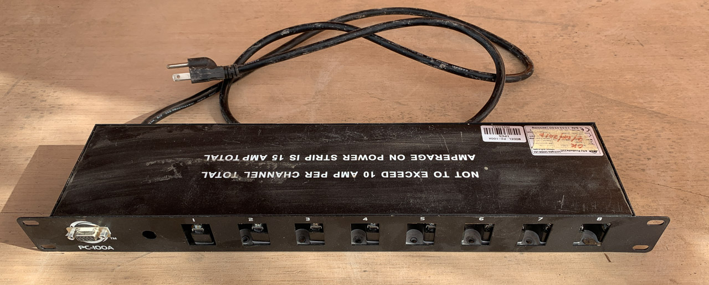
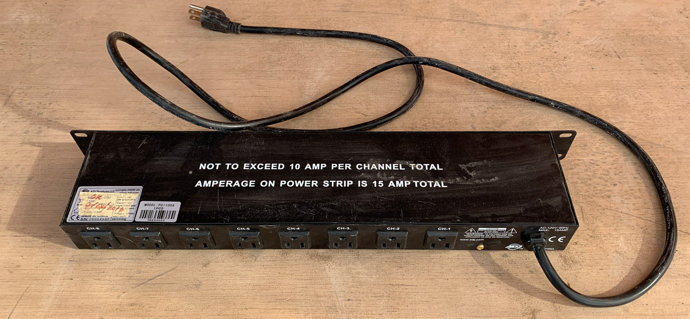
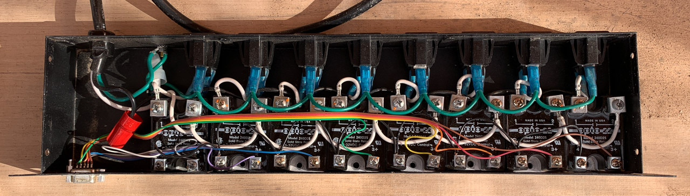

#### Solid State Relay Connections

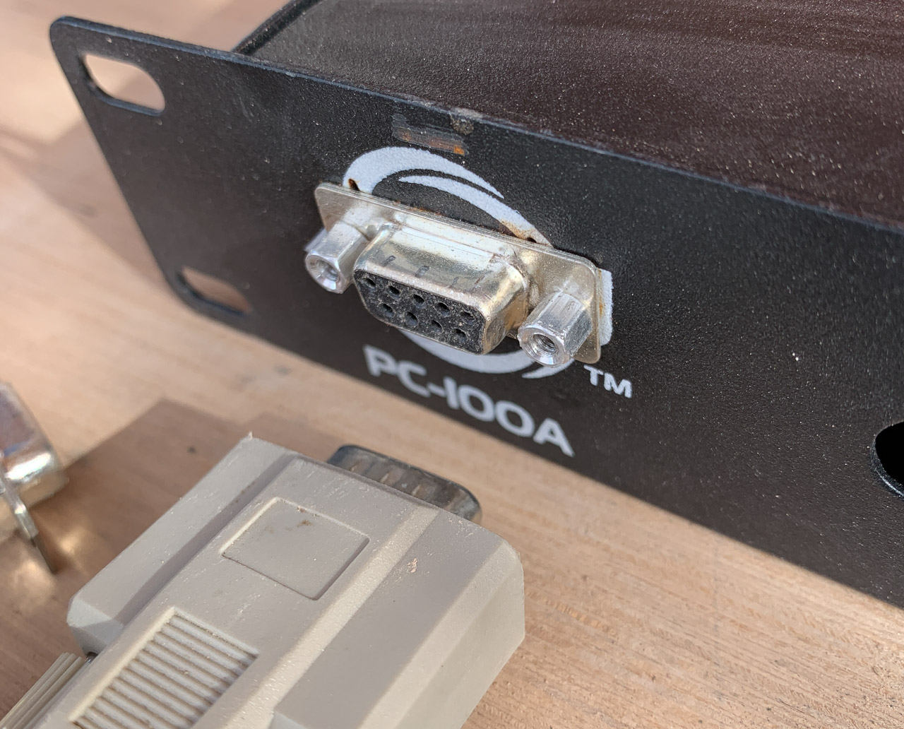

* The CD4094s are wired to DB9 connectors typically used for serial connections.
* Serial pins are mapped as follows:

```
Pin Name		CD4094  	DB9
--------		------  	---
Q1			4		1
Q2			5		2
Q3			6		3
Q4			7		4
Q5			14		5
Q6			13		6
Q7			12		7
Q8			11		8
Ground			8		9

``` 
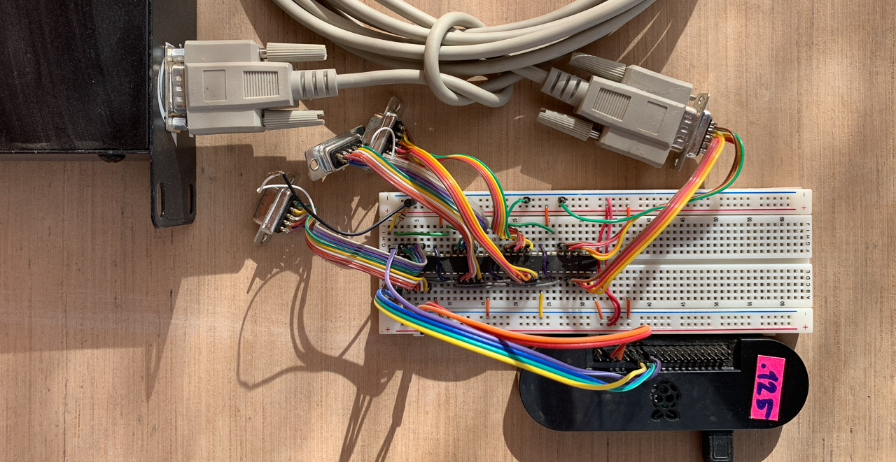

### Software

The goal of the software is:

1. read in data over a given protocol
1. translate it to control signals for the CD4094 shift registers

Currently, the encoding is 1:1 in such a way that each byte represents the desired state of the shift register output pins:

```
In the Forest installation, 32 channels were encoded in 4 bytes as follows.

Byte 1 = lights 1-8
-------------------
00000000

Byte 2 = lights 9-16
-------------------
00000000

Byte 3 = lights 17-24
-------------------
00000000

Byte 4 = lights 25-32
-------------------
00000000
```

**Raspberry Pi**

The Raspberry Pi is running Python code that translates incoming data streams (currently TCP/IP payloads) into control signals for the CD4094 via a custom [rpi-cd4094](https://github.com/phillipdavidstearns/rpi-cd4094.git) package, a convenient wrapper of the standard [RPi.GPIO](https://pypi.org/project/RPi.GPIO/) package used for reading from and writing to the Raspberry Pi's General Purpose Input/Output pins.

Any application that can open a raw TCP/IP connection can control the lights.

**Arduino**

The Arduino runs a sketch that accepts serial over the USB connection and translates 4 bytes into the signals to control 4 CD4094 shift registers for a total of 32 channels.

## Installation (OSX)

1. Create a project directory: `mkdir ~/my_project`
1. Change to that directory: `cd ~/my_project`
1. Clone this repository: `git clone https://github.com/phillipdavidstearns/2DollarDMX.git` 

### Raspberry Pi

1. `ssh` into your Raspberry Pi
1. Clone rpi-cd4094: `git clone https://github.com/phillipdavidstearns/rpi-cd4094.git`
1. Install rpi-cd4094: `cd rpi-cd4094; sudo python3 setup.py install`
1. Follow the directions to install the_forest at: [https://github.com/phillipdavidstearns/the_forest](https://github.com/phillipdavidstearns/the_forest)

### Arduino

1. Download and Install the Arduino IDE
1. Install the TimerOne library: `cd ~/Documents/Arduino/libraries; git clone https://github.com/PaulStoffregen/TimerOne`
1. Flash your Arduino with the sketch located at `2DollarDMX/examples/arduino/serial_control/serial_control.ino`

## Connections

**Raspberry Pi**

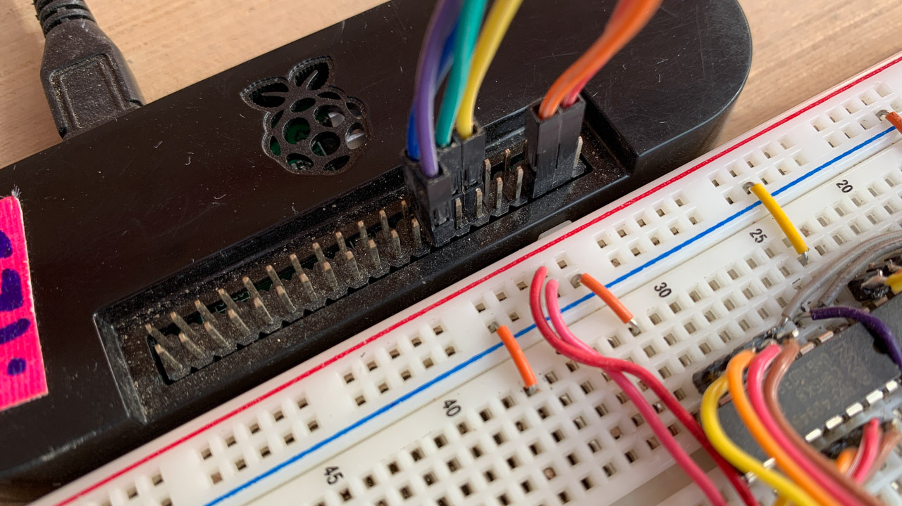
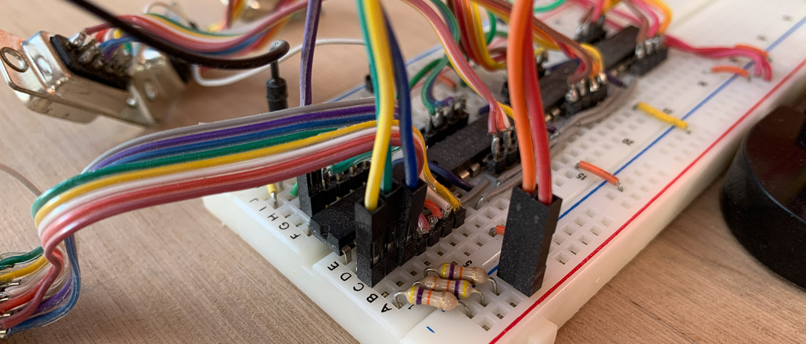
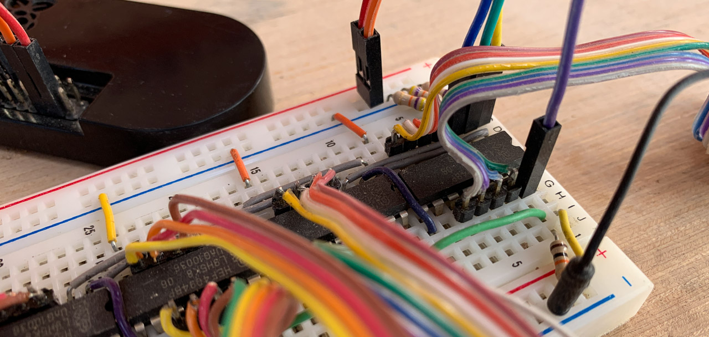

**Arduino**

*nothing here yet, but refer to the Arduino sketch for hard coded pins*

## Operation

**Raspberry Pi**

See [the_forest](https://github.com/phillipdavidstearns/the_forest) repo for examples of how this hardware setup was used to:

* Visualize network broadcst traffic in real-time
* Allow for local network control over TCP/IP

**Arduino**

*come back later*

## Max channels?

#### Arduino

Operations per bit (and cost in clock cycles) using port manipulation. Timings based on [this post](https://timodenk.com/blog/port-manipulation-and-arduino-digitalwrite-performance/).

**Shifting Data into the Register:**

* set data pin (2 clock cycles)
* set clock pin HIGH (2 clock cycles)
* set clock pin LOW (2 clock cycles)
* 6 cycles total per channel

**Updating Register (strobe the latch)**

* set strobe pin HIGH (2 clock cycles)
* set strobe pin LOW (2 clock cycles)
* 4 cycles to update

**Theoretical Max Number of Channels**

* Cycles per frame @ 30 fps = 16Mhz / 30fps = 533,333 cycles per frame
* 533,333 cycles per frame - 4 cycles to strobe = 533,329 cycles
* 533,329 cycles / 6 cycles per channel = 88,888 channels

#### Raspberry Pi

Although the processor is much faster on the Raspberry Pi that that of the Arduino, running the GPIO at large percentage of the available CPU speed will consume massive amounts of energy. To look at the problem from a different angle, you could calculate the minimum required clock speed for a given number of channels.

* number of channels x cycles per channel + 4 x number of updates per second = minimum required clock rate
* 2048 elements per frame @ 30 frames per second would require a clock rate of 368760Hz (2048 x 6 + 4 x 30)
